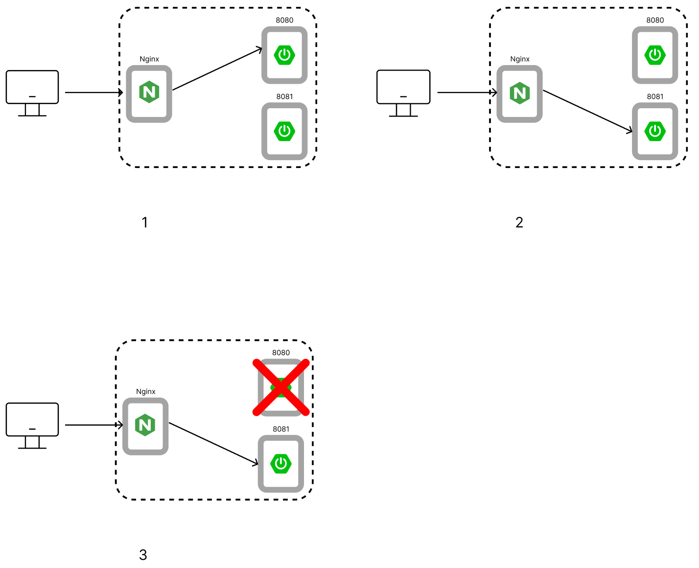
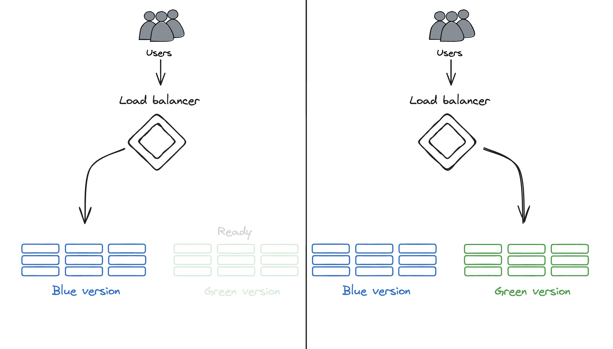
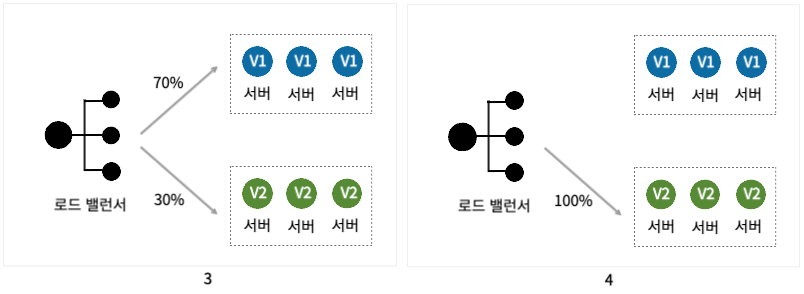
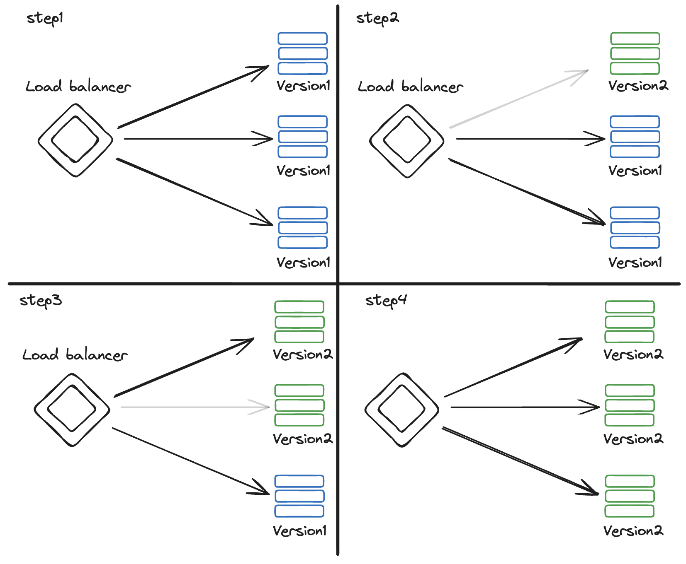
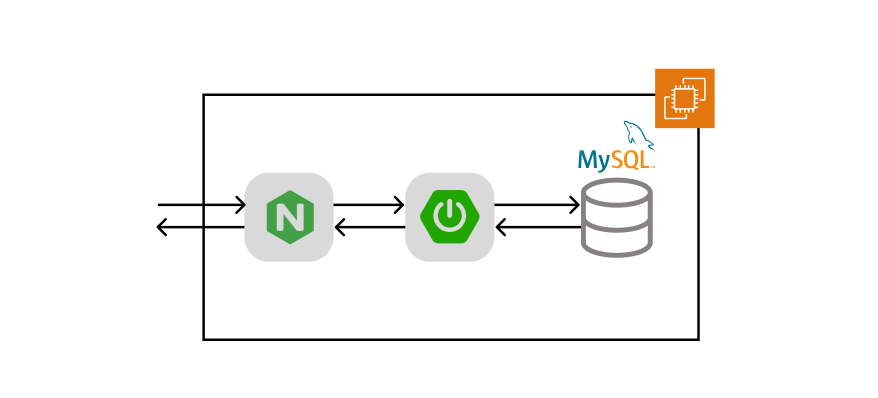

# 루티 팀의 무중단 배포 도전기

안녕하세요, 우아한테크코스 7기 “루티” 팀의 백엔드 개발자 머랭입니다.

우아한테크코스에서 프로젝트를 한 지 어느덧 세 달이 지났습니다.

저희 팀은 무중단 배포를 도입하기로 결정했는데요.

무중단 배포를 도입하며 습득한 지식과 팀의 의사결정 과정을 공유해드리고자 합니다.

본격적인 시작에 앞서, 무중단 배포가 무엇인지 알아보도록 하겠습니다.

# 무중단 배포란?

배포 시, 서버 다운타임(Downtime)을 극도록 낮추는 것을 지향하는 배포 방식입니다.

**빅뱅 배포** 방식의 문제점을 해결하기 위해 등장했습니다.

- **빅뱅 배포**: 배포 시에 기존 애플리케이션을 종료하고 새로운 버전의 애플리케이션을 실행시키는 방식입니다.

  새로운 애플리케이션이 완전히 실행되기 전 다운타임이 존재합니다.


# 루티 팀이 무중단 배포를 해야 하는 이유

## **1. 개발/협업 환경에서의 비효율성 해소**

루티 팀의 **개발/테스트 환경**에서는 **세 번 중 한 번꼴**로 **“배포 중으로 인한 서버 연결 실패”** 문제가 발생하고 있습니다.

프론트엔드 팀원은 몇 분의 기다림 끝에 “배포 중”이라는 답변을 받게 됩니다.

비효율적인 확인 절차는 프론트엔드 팀원의 **개발 흐름을 방해**하고 배포 완료 시점까지 **리소스를 낭비**하게 만드는 원인입니다.

## **2. 프로덕션 환경에서의 사용자 이탈 최소화**

개발 환경에서 반복적으로 발생하는 다운타임 문제는 **프로덕션 환경의 운영 리스크**로 전이될 수 있습니다.

반복되는 다운타임은 사용자들에게 **"불안정한 서비스"**라는 부정적 인식을 심어주어 **사용자 경험을 저해시키고 사용자** **이탈**을 초래하는 원인입니다.

## 요약

개발 과정에서의 비효율성을 제거하고, 프론트엔드/백엔드 간의 협업 신뢰도와 생산성을 높여야 합니다.

사용자 경험 유지와 서비스 신뢰도를 보장하기 위해 고가용성을 확보해야 합니다.

💡참고💡: 지금부터 설명할 무중단 배포 방식 중, 스위치 배포는 일반적으로 알려진 블루/그린 배포를 저만의 방식대로 해석해 분류한 배포 방식입니다.

# 무중단 배포 방식

## 1. 스위치 배포

트래픽을 한 번에 전환(스위칭)하는 배포 방식입니다.

새로운 버전의 서버(들)를 실행시킨 후, 헬스 체크를 통해 안정화 여부를 판단합니다.

안정적이라고 판단되면, 모든 트래픽을 한 번에 새로운 버전의 서버(들)로 스위칭합니다.

### 스위치 배포의 장점

1. **구현의 편의성**

   점진적 배포 방식에 비해 구현이 간편합니다.

2. **빠른 롤백**

   문제 발생 즉시 모든 트래픽을 한 번에 이전 버전의 서버(들)로 스위칭할 수 있으므로, 롤백이 빠릅니다.


### 스위치 배포의 단점

1. **위험 부담**

   새로운 버전 서버(들)에 런타임 문제 존재 시, 롤백 전까지 모든 사용자들이 영향받습니다.


1. **리소스 부담**

   새로운 버전의 애플리케이션의 안정성을 판단하기 전까지 기존 버전의 서버(들)이 대기 중이어야 하기 때문에, N대의 서버가 추가적으로 필요합니다.


### 스위치 배포 - 포트 스위칭 배포

단일 서버에서 애플리케이션이 구동 중일 때 사용할 수 있는 방식입니다.

새 버전의 애플리케이션을 새로운 포트로 실행시킨 후, 리버스 프록시 설정을 변경해 트래픽을 새로운 포트로 포워딩하는 방식입니다.



개념적으로는 블루/그린 배포와 비슷하지만 블루와 그린 애플리케이션이 완전히 격리될 수 없으므로, 블루/그린 배포 방식과 나누어 정의했습니다.

**포트 스위칭 배포 시나리오 예시**

1. Nginx 를 통해 443 → 8080 포트포워딩 중입니다.
2. 8081 포트로 새 버전의 애플리케이션 실행 후, 헬스 체크를 수행합니다.
3. 새 버전의 애플리케이션이 안정적이라고 판단되면, Nginx 리버스 프록시 설정을 변경합니다. (443 → 8081)
4. 기존 애플리케이션(8080)은 대기 상태로 잠시 유지합니다.
5. 새 버전의 애플리케이션을 모니터링합니다.
6. 문제가 없다고 판단되면 기존 애플리케이션(8080)을 종료합니다.

**포트 스위칭 배포의 장점**

1. **구현의 편의성**

   단순 포트 스위칭만으로 구현할 수 있어 구현이 매우 간단합니다.


**포트 스위칭 배포의 단점**

1. **하드웨어 한계**

    ```bash
    # 현재 총 메모리 사용량
    # 메모리: 1.8GiB 중 973MiB 사용 중 (약 52.79% 사용 중)
    # 스왑 메모리는 고려하지 않음
                   total        used        free      shared  buff/cache   available
    Mem:           1.8Gi       973Mi        89Mi        20Mi       967Mi       869Mi
    Swap:          4.0Gi       643Mi       3.4Gi
    
    # 스프링 애플리케이션의 메모리 사용량 = 391160KiB = 381.99 MiB = 전체 메모리의 약 20.7%
    top -p {프로세스ID}
    
    PID    USER      PR   NI VIRT     RES     SHR    S   %CPU  %MEM     TIME+    COMMAND 
    804384 root      20   0  3203564  391160  23772  S   0.0   20.7     2:29.71  java
    ```

   루티 프로덕션 환경을 기준으로, 하나의 스프링 애플리케이션은 약 20.7%의 메모리를 차지합니다.

   스프링 애플리케이션을 하나 더 실행시키면, 메모리 사용률이 52.79%에서 73.51%가 됩니다. (약 20.7% 증가)

   심지어, 트래픽이 증가해 힙(Heap)영역에 데이터가 증가하게 되면 메모리 사용률은 더 증가합니다.

   또한, 메모리 캐싱같은 메모리 기반 데이터 저장 로직이 도입되면 메모리가 부족해질 가능성이 높습니다.

   만약 기본 메모리가 부족해진다면, **“I/O 작업으로 인해 느린”**스왑 메모리 사용이 요구됩니다.


1. **불완전한 격리**

   새 버전의 애플리케이션을 테스트하며 발생하는 하드웨어적 문제가 전파되므로, 잠재적인 위험이 존재합니다.

   새 버전의 애플리케이션의 문제가 OS 문제로 번지면, 기존 애플리케이션에도 영향을 미치게 됩니다.

    ```text
   ❗이 단점으로 인해,  포트 스위칭 배포는 블루/그린 배포 방식이라고 할 수 없습니다.
   
   블루/그린 배포에서는 그린 환경에서 문제 발생 시 블루 환경으로 스위칭할 수 있어야 합니다.
   
   포트 스위칭 배포는 불완전한 격리 문제로 인해 **그린 환경에 문제가 발생해도 블루 환경으로 스위치할 수 없을 가능성이 존재**합니다.
    ```

### 스위치 배포 - 블루/그린 배포

운영 중인 환경과 동일한 새로운 환경을 구축하여 애플리케이션의 신규 버전을 배포하는 방식입니다.

기존에 실행되던 환경을 블루 환경, 신규 버전이 실행될 환경을 그린 환경이라 합니다.

그린 환경의 모든 애플리케이션이 실행되고 헬스 체크가 완료되면, 로드밸런서 설정을 변경해 트래픽을 그린 환경으로 전환합니다.



**블루/그린 배포 시나리오 예시**

1. 블루 환경과 동일한 인프라(EC2, 클러스터링 등)를 갖춘 그린 환경을 준비합니다.
2. 그린 환경에 새로운 버전을 배포하고, 헬스 체크를 수행합니다.
3. 그린 환경이 안정적이라고 판단되면, 로드 밸런서의 설정을 변경하여 모든 사용자 트래픽을 블루 환경에서 그린 환경으로 전부 스위칭합니다.
4.  그린 환경을 모니터링합니다.
5. 문제가 없다고 판단되면 블루 환경을 종료합니다.

**블루/그린 배포의 장점**

1. **완벽한 격리**

   서버를 격리하기 때문에, 그린 환경을 테스트하며 발생하는 문제가 블루 환경으로 전파되지 않습니다.

   예) 그린 환경에서 급작스럽게 메모리의 90%를 사용하게 되어도, 블루 환경에는 영향을 미치지 않습니다.


**블루/그린 배포의 단점**

1. **비용**

   그린 환경 준비/실행과 블루 환경이 대기하는 기간에 두 배의 서버를 필요로 합니다.


## 2. 점진적 배포

새로운 버전의 서버를 전체 사용자에게 한 번에 노출하는 대신, 새로운 버전의 서버로 향하는 사용자 트래픽을 점진적으로 늘려가는 방식입니다.

### 점진적 배포의 장점

1. **위험 부담 최소화**

   트래픽을 한 번에 전환하지 않고 점진적으로 전환하므로, 새 버전에서 문제가 발생해도 모든 사용자에게 영향을 미치지 않습니다.


1. **비용 부담 최소화**

   스위칭 배포와 달리 N대의 서버를 필요로 하지 않으므로, 비용 부담이 적습니다.

   (카나리 배포 사용 시 서버가 추가적으로 필요하지만, N보다 적은 수의 서버를 사용하고 블루/그린 배포에 비해 업타임(Uptime)이 적습니다)


### 점진적 배포의 단점

1. **복잡한 구현**

   새 버전을 점진적으로 배포하고 모니터링하기 위한 복잡한 구현이 필요합니다.


1. **하위 호환성 보장 필요**

   같은 시점에 두 버전의 애플리케이션이 실행되므로, API나 DB 스키마 변경사항이 하위 호환성을 보장하도록 설계해야 합니다.


### 점진적 배포 - 카나리 배포

새로운 버전을 전체 사용자 중 아주 작은 비율(1%∼5% 등)에게만 먼저 노출하여, 문제가 없는지 테스트하고 검증하는 방식입니다.

위험 부담을 극도로 최소화하고, 실제 사용자 데이터(에러율, 지연 시간)를 분석하여 의사결정을 내리는 점은, 롤링 배포와 가장 큰 차이점입니다.

새로운 버전의 서버 그룹을 카나리 그룹이라 합니다.

카나리 그룹으로 향하는 트래픽을 분석해 배포 지속 여부를 판단하고, 카나리 그룹으로 향하는 트래픽을 점차 늘려 100%로 만듭니다.




**카나리 배포** **시나리오 예시**

1. 적은 수의 노드를 가지는 새로운 클러스터를 만들어 새로운 버전을 배포하고, 카나리 그룹으로 지정합니다.
2. 로드 밸런서 설정을 변경하여 전체 트래픽의 일부만 카나리 그룹으로 보냅니다.
3. 카나리 그룹의 에러율, 응답 시간, CPU/Memory 사용률 등의 지표를 기존 그룹과 비교 분석합니다.
4. 안전하다고 판단되면 카나리 트래픽 비율을 점차 늘려 카나리 그룹의 노출 범위를 확대합니다.
5. 이 과정에서, 트래픽 비율과 더불어 카나리 그룹 내 노드 수도 증가시킵니다.
6. 100% 전환이 완료되면 기존 서버를 제거합니다.

**카나리 배포의 장점**

1. 가장 높은 안정성

   카나리 그룹을 지속적으로 모니터링하며 배포 진행/롤백 여부를 결정할 수 있습니다.

   새로운 버전에 문제가 생겨도 극히 일부의 사용자들만 영향받습니다.

2. 데이터를 통한 의사결정

   카나리 그룹을 모니터링하며 얻은 데이터를 통해 의사결정을 할 수 있습니다.(A/B 테스트)


**카나리 배포의  단점**

1. 구현, 유지보수의 복잡성

   카나리 그룹을 모니터링하기 위한 시스템을 설계해야 합니다.

   다른 배포 방식에 비해 구현과 유지보수가 복잡합니다.


1. 긴 배포 시간

   카나리 그룹을 모니터링하며 점진적으로 배포하기 때문에, 최종 배포 완료 시간이 가장 깁니다.


### 점진적 배포 - 롤링 배포

클러스터 내 운영 중인 기존 노드들을 하나씩 또는 작은 그룹 단위로 새 버전의 노드로 교체해나가는 방식입니다.

자원 효율성에 초점을 맞춘 배포 방식으로, 추가 서버가 필요하지 않아 **클러스터의 전체 규모가 유지됩니다.**



**롤링 배포 시나리오 예시**

1. 새 노드를 생성한 후, 새 버전의 애플리케이션을 실행시킵니다.
2. 새 노드와 애플리케이션에 대한 헬스 체크가 완료되면 새 노드를 클러스터에 등록합니다.
3. 기존 버전 노드 하나를 클러스터에서 제거, 종료합니다.
4. 1~3을 반복합니다.
5. 최종적으로, 모든 노드가 새 노드로 교체됩니다.

**롤링 배포의 장점**

1. 자원 효율성

   다른 배포 방식과 달리, 추가적인 서버 인스턴스를 필요로 하지 않습니다.


**롤링 배포의 단점**

1. 불완전하고 느린 롤백

   새로운 버전에서 문제 발생 시, 이전 버전과 똑같은 수준의 인프라로 롤백할 수 없습니다.

   총 노드 수: N

   남은 기존 버전 노드 수: K

   생성된 새 버전 노드 수: M

   새 노드에서 문제 발생 시, 새 노드 M개를 전부 제거하고 기존 버전 노드 M개를 다시 생성해야 합니다.

   긴 시간이 소요되며, 그 동안 K개의 노드가 모든 요청을 처리해야 합니다.


# 루티는 어떤 배포 방식을 사용할 것인가?

## 현재 루티 인프라



단일 EC2에서 Nginx, Spring 애플리케이션, MySQL을 전부 실행하고 있는 중입니다.

## 고려해야 할 사항

### 비용

우아한테크코스 AWS 내 최대 사용 가능 비용을 고려했을 때, 30$ 내에서 무중단 배포를 구현해야 합니다.

참고: 루티의 애플리케이션용 EC2 인스턴스는 약 17$의 비용을 요구합니다.

### 구현 리소스

런칭 데이 전(7일)에 무중단 배포를 구현해야 합니다.

### 미래 인프라 대규모 이동

약 3주 안에 우아한테크코스의 aws에서 루티와 관련된 모든 리소스를 제거하고, 루티 팀 aws를 다시 구축해야 합니다.

## 배포 방식 결정 - 포트 스위칭 배포

다양한 측면을 고려해 결정한 배포 방식은 **포트 스위칭 배포**입니다.

## 이유

### 비용 측면

포트 스위칭 배포 방식은 추가 인프라 구축 비용이 거의 발생하지 않습니다.

새 애플리케이션을 새로운 포트에 일시적으로 구동할 때 일시적인 메모리 부하만 발생시킬 뿐, 인프라 확장이 필요 없습니다.

반면, 블루/그린이나 카나리 같은 클러스터 기반 무중단 배포를 도입하기 위해서는 서버를 격리하고 트래픽을 분산하기 위한 필수적인 인프라 증설이 요구됩니다.

루티의 애플리케이션용 EC2 인스턴스는 약 17$의 비용을 요구합니다.

로드밸런서의 비용을 10$라고 산정하겠습니다.

클러스터를 최소(단일) 노드로만 구성하다고 가정했을 때, 27$의 추가 비용이 발생하게 됩니다.(로드밸런서 + 애플리케이션 인스턴스)

**트래픽 증가를 고려했을 때, 한정된 비용(30$) 내에서 구현하기 위해서는 포트 스위칭 배포 방식이 최선입니다.**

### 구현 리소스 측면

배포 방식 별 구현에 필요한 리소스를 산정해 보았습니다.

1. **포트 스위칭 배포**

   **2~3일 내**에 구현할 수 있습니다. Nginx 설정 난이도가 낮으며, 현재 구현되어있는 애플리케이션 실행, 복구 스크립트를 재활용할 수 있기 때문입니다.

2. **블루/그린 배포**

   클러스터를 구축해야 하며, 노드 자동 생성, 설정 초기화 아키텍처를 구축해야 합니다. (AWS AMI, ASG, EC2 User Data 등)

   클러스터 구축 경험이 없는 상태에서 레퍼런스를 참고해 구현하기 위해서 **7일이 소요**될 것으로 예상됩니다.

3. **카나리 배포**

   클러스터를 구축해야 하며, 노드 자동 생성, 설정 초기화 아키텍처를 구축해야 합니다. (AWS AMI, ASG, EC2 User Data 등)

   이와 더불어, 카나리 그룹 대상 모니터링 시스템과 점진적 배포 시스템을 설계, 구축해야 합니다.

   학습량이 많을 것으로 예상되며, **30일 이상 소요**될 것으로 예상됩니다.

4. **롤링 배포**

   클러스터를 구축해야 하며, 노드 자동 생성, 설정 초기화 아키텍처를 구축해야 합니다. (AWS AMI, ASG, EC2 User Data 등)

   클러스터 구축 경험이 없는 상태에서 레퍼런스를 참고해 구현하기 위해서는 **9일이 소요**될 것으로 예상됩니다.


**정리**

|  | **클러스터 구축 여부** | **구현 복잡성** | **예상 소요일** |
|:---:|:---:|:---:|:---:|
| **포트 스위칭 배포** | X | 하 | 2~3일 |
| **블루/그린 배포** | O | 중 | 7일 |
| **카나리 배포** | O | 상 | 30일 이상 |
| **롤링 배포** | O | 중 | 9일 |

우아한테크코스에서의 다른 활동이 많기 때문에, 최종 예상 소요일은 실제 예상 소요일보다 길게 산정하는 것이 좋습니다.

**제한된 시간(7일) 내에 구현하기 가장 적절한 방식은 포트 스위칭 배포** 방식입니다.

### 미래 인프라 대규모 이동 측면

약 3주 안에 우아한테크코스의 aws에서 루티와 관련된 모든 리소스를 제거하고, 루티 팀 aws를 다시 구축해야 합니다.

복잡한 무중단 배포 인프라를 구축하는 경험은 추후 인프라 재건 시 도움이 되는 **유의미한 학습 기회**입니다.

그러나, 일시적 인프라 구축 경험을 얻기 위해 소모되는 시간은 **높은 기회비용**을 발생시킵니다.

루티는 비즈니스 로직 성능 개선, 기존 로직 고도화 등 서비스의 핵심 가치와 직결된 과제를 가지고 있습니다.

당장 해결해야 할 **서비스의 핵심 문제**와 **단기적 인프라 구축 경험**을 비교했을 때, **서비스의 핵심 문제**에 집중하는 것이 가장 적절하고 합리적인 선택입니다.

**리소스가 크게 소모되는 배포 시스템 선택은 지양해야 합니다.**
